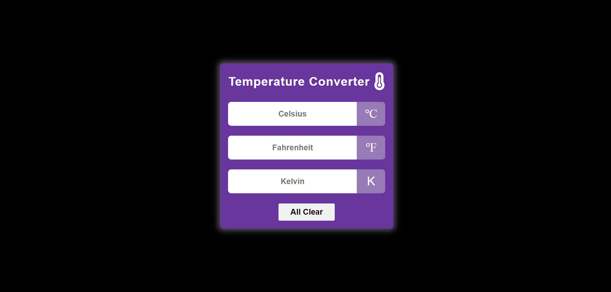

# Temperature Converter

## Table of Contents

- [About](#about)
- [Preview](#Preview)

## About

The Temperature Converter is a simple web-based tool created using HTML, CSS, and JavaScript. It allows users to convert temperatures between Celsius, Fahrenheit, and Kelvin units.

The application features an intuitive user interface and provides real-time conversion as users input values. It's a handy tool for quickly converting temperatures for various purposes.

## Preview

